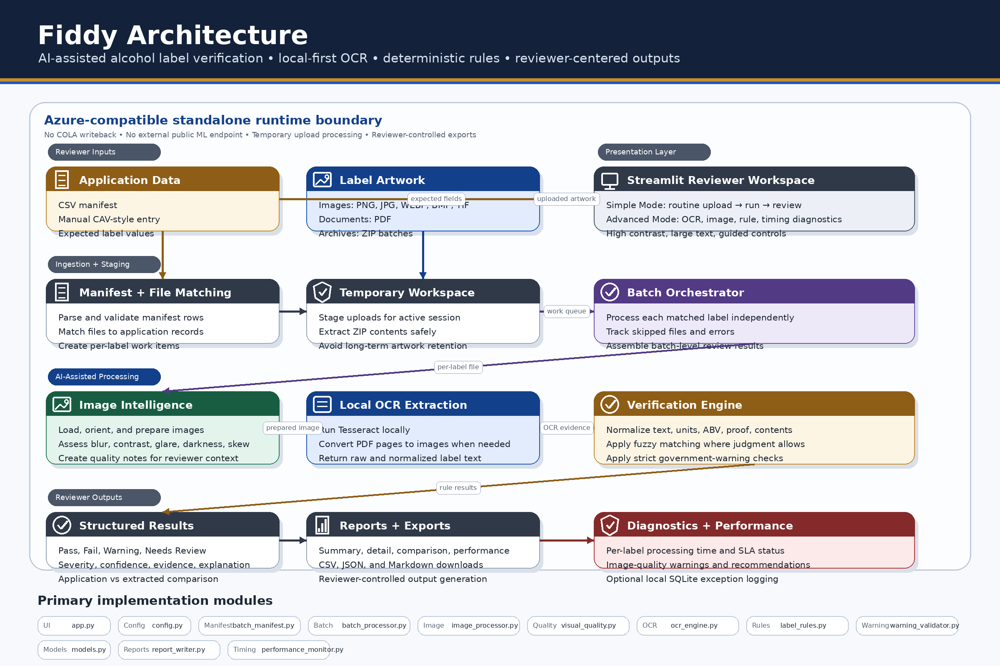
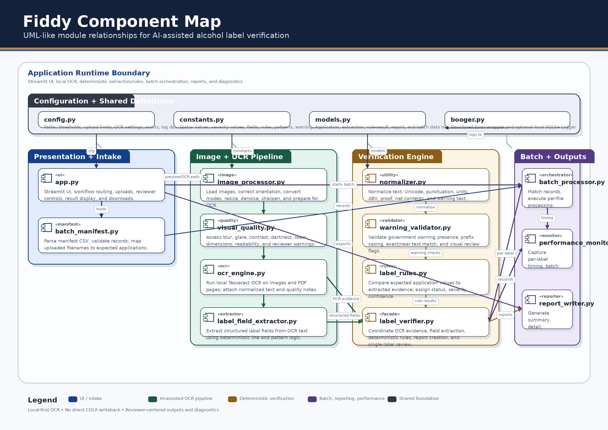

###### Fiddy


[Overview](#-overview) •
[Installation](#%EF%B8%8F-installation) •
[Capabilities](#-capabilities) •
[Workflow](#-workflow) •
[Architecture](#%EF%B8%8F-architecture) •
[Components](#%EF%B8%8F-component-uml) •
[Usage](#-usage-examples) •
[Outputs](#-outputs) •
[Configuration](#%EF%B8%8F-configuration) •
[Run](#%EF%B8%8F-run-the-app) 
___

**AI-Powered Alcohol Label Verification App**

Fiddy is a standalone Streamlit application that helps alcohol-label compliance reviewers compare
submitted label artwork against application data. It combines AI-assisted local OCR, deterministic
verification rules, fuzzy matching, image-quality diagnostics, batch processing, and downloadable review outputs
into a fast, explainable reviewer-assist workflow.

Fiddy is designed for practical compliance operations: upload the application data, upload the label
artwork, run verification, review exceptions, and download results.

## 📌 Overview

Fiddy supports alcohol-label review by comparing application data to the text and evidence found on
submitted label artwork.

The reviewer can work from a CSV manifest for batch review or enter CAV-style application values
manually for single-label review. Fiddy then extracts readable label text using local OCR, evaluates
the label against structured application values, and produces a field-by-field review surface with
status, severity, confidence, explanation, and recommended reviewer action.

The application is intentionally transparent. It does not hide uncertainty behind a false pass. If
OCR is weak, if an image is difficult to read, or if a visual condition requires judgment, Fiddy
marks the item for review and explains why.
Here’s a **short, clean, README‑friendly version** that blends naturally with your existing style,
avoids addressing any individual, and aligns with the stated goal in the email: *to understand how
you approach problems relevant to the work.*

It keeps the icons, keeps it tight, and stays focused on demonstrating problem‑solving approach
rather than addressing a person.

---

## 🚀 Solution Alignment & Assignment Goals

This implementation was structured to demonstrate a clear, practical approach to automating
alcohol‑label review while emphasizing explainability, security, and alignment with real analyst
workflows.

- **🔍 Automated Evidence Extraction** — Local OCR and image diagnostics pull structured text and
  visual cues directly from label artwork to support reliable field‑level comparison.

- **⚖️ Transparent, Deterministic Matching** — Each field produces a status, severity, confidence
  score, and concise explanation, reflecting an emphasis on clarity and auditability.

- **📦 Batch Processing via Manifest** — A manifest‑driven workflow enables consistent, repeatable
  processing of multiple applications and label sets.

- **🔐 Local‑Only Execution** — All OCR, diagnostics, and matching run locally, avoiding external
  inference services and supporting secure, offline operation.

- **🧭 Workflow Aligned With Analyst Practice** — The pipeline mirrors real review steps: *Upload →
  Extract → Diagnose → Compare → Flag exceptions → Review → Export.*

- **🧱 Modular Architecture** — OCR, diagnostics, matching, and reporting are separated into clear
  components, making the system maintainable, testable, and easy to extend.

- **🧑‍⚖️ Human‑in‑the‑Loop Handling** — Low‑confidence or ambiguous fields are routed for manual
  review, reducing false positives and supporting compliance‑oriented decision‑making.

---

If you want, I can also generate a **super‑compact version** or help you decide **where in the
README this fits best**.
## 🧠 AI-Assisted Verification

Fiddy is AI-assisted, not AI-autonomous. The application uses local OCR, image analysis, fuzzy
matching, confidence scoring, and deterministic compliance rules to help reviewers evaluate alcohol
label artwork faster and more consistently.

The AI-assisted pipeline performs four jobs:

1. **Read the label artwork** using local OCR.
2. **Assess image quality** so weak OCR evidence is not treated as reliable.
3. **Compare extracted evidence** against application data using deterministic and fuzzy matching.
4. **Route uncertainty to human review** when the system cannot responsibly make a clear
   determination.

Fiddy does not use an external generative AI endpoint, does not send labels to a public ML service,
and does not make final compliance decisions. Its purpose is to reduce routine comparison work and
focus reviewer attention on exceptions.

| Capability                   | Description                                                                                    |
|------------------------------|------------------------------------------------------------------------------------------------|
| OCR extraction               | Converts label artwork into machine-readable text using local Tesseract OCR.                   |
| Image intelligence           | Evaluates blur, contrast, glare, skew, darkness, and readability before relying on OCR output. |
| Fuzzy matching               | Handles minor text variations such as punctuation, casing, spacing, and apostrophes.           |
| Confidence scoring           | Assigns confidence values to help reviewers understand result strength.                        |
| Human-review safeguards      | Marks uncertain, low-quality, or visually dependent findings for manual review.                |
| Deterministic rule reasoning | Applies transparent review logic to extracted evidence and application values.                 |

## ✨ Capabilities

| Capability              | What Fiddy Does                                                                         |
|-------------------------|-----------------------------------------------------------------------------------------|
| Label artwork intake    | Accepts image files, PDFs, and ZIP archives containing label artwork.                   |
| Application data intake | Accepts manifest CSV uploads or manual CAV-style entry.                                 |
| Local OCR               | Extracts label text using local Tesseract OCR.                                          |
| Image preparation       | Loads, orients, converts, and prepares label images for OCR.                            |
| Image diagnostics       | Evaluates practical OCR risk factors such as blur, glare, darkness, contrast, and skew. |
| Field comparison        | Compares expected application values against extracted or observed label evidence.      |
| Fuzzy matching          | Tolerates minor text variation where ordinary reviewer judgment would tolerate it.      |
| Strict warning review   | Handles government-warning text separately from ordinary fuzzy fields.                  |
| Batch verification      | Processes matched manifest rows and uploaded files as independent label reviews.        |
| Reviewer guidance       | Provides status, severity, confidence, explanation, and recommended action.             |
| Downloadable reports    | Exports summary, detail, comparison, performance, JSON, and Markdown outputs.           |
| Local diagnostics       | Supports optional SQLite exception logging for troubleshooting.                         |
| Azure fit               | Runs as a standalone local-first workload suitable for Azure-hosted deployment.         |


## 🧭 Workflow

Fiddy supports two reviewer workflows.

### Simple Mode

Simple Mode is the operational path for routine review.

```text
Upload application data and label artwork
        ↓
Run verification
        ↓
Review results and download outputs
```

Simple Mode keeps the screen focused on the reviewer’s decision surface.

### Advanced Mode

Advanced Mode exposes additional technical evidence when needed.

```text
Manifest preview
Uploaded-file preview
File matching diagnostics
OCR text
Image-quality diagnostics
Rule detail
Performance timing
Downloadable outputs
```

Advanced Mode is useful for testing, troubleshooting, demonstration, and quality review.

## 🏗️ Architecture

Fiddy is organized as a local-first verification pipeline that separates the reviewer interface,
ingestion workflow, OCR/image processing, verification engine, reporting layer, diagnostics, and
Azure-compatible runtime boundary.

<p align="center">
  
</p>

### Runtime Boundary

```text
┌──────────────────────────────────────────────────────────────────────────────┐
│                      AZURE-COMPATIBLE RUNTIME BOUNDARY                       │
├──────────────────────────────────────────────────────────────────────────────┤
│ Local OCR and deterministic rule execution                                   │
│ No external machine-learning endpoint dependency                             │
│ Standalone operation without direct COLA writeback                           │
│ Temporary upload handling during the active review session                   │
│ Reports generated only through reviewer-initiated downloads                  │
└──────────────────────────────────────────────────────────────────────────────┘
```

## 🧩 Components

| Component                                                                                             | Role                                                                                               |
|-------------------------------------------------------------------------------------------------------|----------------------------------------------------------------------------------------------------|
| [app](https://github.com/is-leeroy-jenkins/Fiddy/blob/main/app.py)                                    | Streamlit interface, workflow routing, uploads, reviewer controls, result display, and downloads.  |
| [config](https://github.com/is-leeroy-jenkins/Fiddy/blob/main/config.py)                              | Application settings, paths, upload limits, OCR settings, thresholds, assets, and logging paths.   |
| [batch_manifest](https://github.com/is-leeroy-jenkins/Fiddy/blob/main/src/batch_manifest.py)          | CSV manifest parsing, validation, filename matching, and conversion to application records.        |
| [batch_processor](https://github.com/is-leeroy-jenkins/Fiddy/blob/main/src/batch_processor.py)        | Batch orchestration, per-file isolation, skipped-file tracking, and batch result assembly.         |
| [image_processor](https://github.com/is-leeroy-jenkins/Fiddy/blob/main/src/image_processor.py)        | Image loading, EXIF orientation correction, mode conversion, and OCR preparation.                  |
| [visual_quality](https://github.com/is-leeroy-jenkins/Fiddy/blob/main/src/visual_quality.py)          | Blur, contrast, glare, darkness, skew, size, and readability diagnostics.                          |
| [ocr_engine](https://github.com/is-leeroy-jenkins/Fiddy/blob/main/src/ocr_engine.py)                  | Local OCR extraction from supported image files and PDF pages.                                     |
| [normalizer](https://github.com/is-leeroy-jenkins/Fiddy/blob/main/src/normalizer.py)                  | Text, punctuation, whitespace, ABV, proof, and unit normalization.                                 |
| [label_rules](https://github.com/is-leeroy-jenkins/Fiddy/blob/main/src/label_rules.py)                | Field-level verification rules, fuzzy matching, numeric comparison, and result creation.           |
| [warning_validator](https://github.com/is-leeroy-jenkins/Fiddy/blob/main/src/warning_validator.py)    | Government-warning presence, exact text, prefix, and visual-review handling.                       |
| [label_verifier](https://github.com/is-leeroy-jenkins/Fiddy/blob/main/src/label_verifier.py)          | Single-label OCR coordination, rule execution, and verification report creation.                   |
| [performance_monitor](https://github.com/is-leeroy-jenkins/Fiddy/blob/main/src/peformance_monitor.py) | Per-label timing and batch-level performance summaries.                                            |
| [report_writer](https://github.com/is-leeroy-jenkins/Fiddy/blob/main/src/report_writer.py)            | Summary, detail, comparison, CSV, JSON, and Markdown report generation.                            |
| [booger](https://github.com/is-leeroy-jenkins/Fiddy/blob/main/src/booger.py)                          | Optional local SQLite exception logging for diagnostics.                                           |


## 🗺️ Component UML

<p align="center">
  
</p>

## 💻 Usage Examples

The Streamlit interface is the primary way to use Fiddy. The following examples show how the core
modules can also be used directly for testing, scripting, or future integration work.

### Verify One Label File

```python
from pathlib import Path

from src.label_verifier import AlcoholLabelVerifier
from src.models import LabelApplication

application = LabelApplication(
	brand_name='OLD TOM DISTILLERY',
	class_type='Kentucky Straight Bourbon Whiskey',
	beverage_type='Distilled Spirits',
	alcohol_content=45.0,
	proof=90.0,
	net_contents='750 mL',
	producer_bottler='Old Tom Distillery LLC',
	imported=False,
	importer='',
	country_of_origin='',
	cola_id='COLA-001',
	notes='Programmatic single-label review.'
)

label_path = Path( 'samples/old_tom_label.png' )

verifier = AlcoholLabelVerifier( )
report = verifier.verify_file( application=application,
	file_path=label_path )

print( report.file_name )
print( report.overall_status )

for result in report.results:
	print( result.field_name, result.status,
		result.severity, result.confidence,
		result.message )
```

### Parse a Manifest

```python
from pathlib import Path

from src.batch_manifest import BatchManifest

manifest_path = Path( 'samples/alcohol_labels.csv' )

manifest = BatchManifest( )
records = manifest.load_records( manifest_path )

for record in records:
	print( record.file_name, record.brand_name, record.alcohol_content )
```

### Convert a Manifest Row to Application Data

```python
from pathlib import Path

from src.batch_manifest import BatchManifest

manifest_path = Path( 'samples/alcohol_labels.csv' )

manifest = BatchManifest( )
records = manifest.load_records( manifest_path )

application = records[ 0 ].to_label_application( )

print( application.brand_name )
print( application.class_type )
print( application.alcohol_content )
```

### Process a Batch

```python
from pathlib import Path

from src.batch_manifest import BatchManifest
from src.batch_processor import BatchProcessor

manifest_path = Path( 'samples/alcohol_labels.csv' )
artwork_folder = Path( 'samples/labels' )

manifest = BatchManifest( )
records = manifest.load_records( manifest_path )

file_paths = [
	path
	for path in artwork_folder.iterdir( )
	if path.suffix.lower( ) in (
		'.png',
		'.jpg',
		'.jpeg',
		'.webp',
		'.bmp',
		'.tif',
		'.tiff',
		'.pdf'
	)
]

processor = BatchProcessor( )
batch_result = processor.process_manifest_records(
	records=records,
	file_paths=file_paths
)

print( 'Processed:', len( batch_result.processed_files ) )
print( 'Skipped:', len( batch_result.skipped_files ) )
print( 'Errors:', len( batch_result.errors ) )

for report in batch_result.batch_report.reports:
	print( report.file_name, report.overall_status )
```

### Generate Review Tables

```python
from src.report_writer import ReportWriter

writer = ReportWriter( )

df_summary = writer.batch_to_summary_dataframe( batch_result.batch_report )
df_details = writer.batch_to_detail_dataframe( batch_result.batch_report )

print( df_summary.head( ) )
print( df_details.head( ) )
```

### Export Results to CSV

```python
from pathlib import Path

from src.report_writer import ReportWriter

output_folder = Path( 'outputs' )
output_folder.mkdir( parents=True, exist_ok=True )

writer = ReportWriter( )

df_summary = writer.batch_to_summary_dataframe( batch_result.batch_report )
df_details = writer.batch_to_detail_dataframe( batch_result.batch_report )

df_summary.to_csv( output_folder / 'fiddy_summary.csv', index=False )
df_details.to_csv( output_folder / 'fiddy_details.csv', index=False )
```

### Inspect OCR Output

```python
from pathlib import Path

from src.ocr_engine import OcrEngine

label_path = Path( 'samples/old_tom_label.png' )

ocr = OcrEngine( )
extracted = ocr.extract_text( label_path )

print( 'File:', extracted.file_name )
print( 'OCR Engine:', extracted.ocr_engine )
print( 'OCR Seconds:', extracted.ocr_seconds )

print( 'Raw OCR Text:' )
print( extracted.raw_text )

print( 'Image Quality Notes:' )
for note in extracted.image_quality_notes:
	print( '-', note )
```

### Validate Government Warning Text

```python
from src.warning_validator import GovernmentWarningValidator

label_text = '''
OLD TOM DISTILLERY
Kentucky Straight Bourbon Whiskey
ALC. 45% BY VOL

GOVERNMENT WARNING:
(1) According to the Surgeon General, women should not drink alcoholic beverages
during pregnancy because of the risk of birth defects.
(2) Consumption of alcoholic beverages impairs your ability to drive a car or operate
machinery, and may cause health problems.
'''

validator = GovernmentWarningValidator( )
validation = validator.validate( label_text )
results = validator.create_results( validation )

for result in results:
	print( result.rule_id, result.status, result.severity, result.message )
```

### Log an Exception Locally

```python
from booger import Error, Logger

try:
	raise ValueError( 'Example failure while processing label artwork.' )
except Exception as e:
	exception = Error(
		error=e,
		cause='Demo',
		method='example_exception_logging',
		module='README'
	)

	row_id = Logger( ).log( exception )
	print( 'Logged row:', row_id )
```


## 📄 Manifest Format

A manifest row represents the expected application data for one uploaded label file.

Recommended CSV header:

```csv
file_name,brand_name,class_type,beverage_type,alcohol_content,proof,net_contents,producer_bottler,imported,importer,country_of_origin,cola_id,notes
```

Example:

```csv
file_name,brand_name,class_type,beverage_type,alcohol_content,proof,net_contents,producer_bottler,imported,importer,country_of_origin,cola_id,notes
old_tom_label.png,OLD TOM DISTILLERY,Kentucky Straight Bourbon Whiskey,Distilled Spirits,45,90,750 mL,Old Tom Distillery LLC,false,,,COLA-001,Demo record
```

| Column                | Description                                                                   |
|-----------------------|-------------------------------------------------------------------------------|
| `file_name`           | Expected uploaded label filename.                                             |
| `brand_name`          | Expected brand name.                                                          |
| `class_type`          | Expected class or type designation.                                           |
| `beverage_type`       | Product category used for review context.                                     |
| `alcohol_content`     | Expected ABV value.                                                           |
| `proof`               | Expected proof, when applicable.                                              |
| `net_contents`        | Expected container volume.                                                    |
| `producer_bottler`    | Expected producer, bottler, brewer, vintner, importer, or responsible party.  |
| `imported`            | Indicates whether imported-product review applies.                            |
| `importer`            | Expected importer when applicable.                                            |
| `country_of_origin`   | Expected country of origin when applicable.                                   |
| `cola_id`             | Optional application or COLA reference.                                       |
| `notes`               | Optional reviewer notes.                                                      |


## 📊 Outputs

Fiddy presents results in progressively detailed layers.

### Batch Dashboard

The dashboard provides a quick summary of the current review run:

* Files reviewed
* Failures
* Warnings
* Needs-review items
* SLA breaches

### Summary Table

The summary table provides one row per processed label.

### Side-by-Side Comparison

The side-by-side comparison is the primary reviewer surface.

| Column          | Purpose                                               |
|-----------------|-------------------------------------------------------|
| File Name       | Identifies the reviewed label file.                   |
| Field           | Shows the label field being checked.                  |
| Application     | Displays the expected application value.              |
| Extracted       | Displays OCR-derived or rule-observed label evidence. |
| Status          | Shows the review outcome.                             |
| Severity        | Indicates the significance of the finding.            |
| Confidence      | Shows the rule confidence score.                      |
| Explanation     | Explains the finding in reviewer-facing language.     |
| Reviewer Action | Recommends the next reviewer step.                    |

#### Downloadable Files

| Output          | Purpose                                              |
|-----------------|------------------------------------------------------|
| Summary CSV     | One row per reviewed label.                          |
| Detail CSV      | One row per rule result.                             |
| Comparison CSV  | Field-by-field application versus label comparison.  |
| Performance CSV | Per-label timing data.                               |
| JSON Report     | Structured machine-readable report.                  |
| Markdown Report | Human-readable review report.                        |


## ♿ Reviewer Controls

Fiddy includes reviewer controls for usability and accessibility:

* Simple Mode
* Advanced Mode
* High-contrast mode
* Large-text mode
* Clear upload labels
* Large primary action button
* Reviewer-facing explanations
* Confidence and severity indicators


## ⚙️ Installation
- Fiddy was built using the PyCharm IDE and using a similar tool for installation is recommended. 
- Detailed installation instructions can be found in the [Installation Guide](https://github.com/is-leeroy-jenkins/Fiddy/blob/main/assets/INSTALLATION.md)
  that is provided in this repo.

### Prerequisites

* Python 3.11 or newer
* Tesseract OCR
* Poppler for PDF support
* Git
* Python virtual environment support

### Clone the Repository

```bash
git clone <repository-url>
cd fiddy
```

### Create a Virtual Environment

Windows PowerShell:

```powershell
python -m venv .venv
.\.venv\Scripts\Activate.ps1
```

Windows Command Prompt:

```cmd
python -m venv .venv
.venv\Scripts\activate.bat
```

macOS / Linux:

```bash
python3 -m venv .venv
source .venv/bin/activate
```

### Install Dependencies

```bash
python -m pip install --upgrade pip
pip install -r requirements.txt
```


## 🔠 OCR Dependencies

### Tesseract

Windows:

```powershell
setx TESSERACT_CMD "C:\Program Files\Tesseract-OCR\tesseract.exe"
```

Ubuntu / Debian:

```bash
sudo apt-get update
sudo apt-get install -y tesseract-ocr
```

macOS:

```bash
brew install tesseract
```

### Poppler

Ubuntu / Debian:

```bash
sudo apt-get install -y poppler-utils
```

macOS:

```bash
brew install poppler
```

Windows:

Install Poppler for Windows and add the Poppler `bin` folder to `PATH`.


## 🛠️ Configuration

Configuration is centralized in [config.py](https://github.com/is-leeroy-jenkins/Fiddy/blob/main/config.py).

| Setting                      | Purpose                                |
|------------------------------|----------------------------------------|
| `APP_NAME`                   | Application name.                      |
| `APP_TITLE`                  | Browser and Streamlit title.           |
| `APP_ICON`                   | Page icon.                             |
| `MAX_UPLOAD_MB`              | Upload size guardrail.                 |
| `MAX_BATCH_FILES`            | Batch size guardrail.                  |
| `OCR_ENGINE`                 | OCR engine identifier.                 |
| `TESSERACT_CMD`              | Optional path to Tesseract executable. |
| `OCR_LANGUAGE`               | OCR language.                          |
| `OCR_TIMEOUT_SECONDS`        | OCR timeout setting.                   |
| `BRAND_MATCH_THRESHOLD`      | Fuzzy brand threshold.                 |
| `CLASS_TYPE_MATCH_THRESHOLD` | Fuzzy class/type threshold.            |
| `LOW_CONFIDENCE_THRESHOLD`   | Low-confidence review threshold.       |
| `REPORT_FILENAME_PREFIX`     | Report download filename prefix.       |
| `LOG_PATH`                   | SQLite exception log database path.    |
| `LOG_FILE`                   | SQLite exception table name.           |

Example `.env` file:

```env
APP_NAME=Fiddy
APP_TITLE=Label Verification
APP_ICON=🥃
OCR_ENGINE=tesseract
OCR_LANGUAGE=eng
OCR_TIMEOUT_SECONDS=5
BRAND_MATCH_THRESHOLD=90.0
CLASS_TYPE_MATCH_THRESHOLD=85.0
LOW_CONFIDENCE_THRESHOLD=70.0
REPORT_FILENAME_PREFIX=fiddy_report
TESSERACT_CMD=C:\Program Files\Tesseract-OCR\tesseract.exe
```


## ▶️ Run the App

Start Fiddy:

```bash
streamlit run app.py
```

Open the local app:

```text
http://localhost:8501
```


## 🧪 Testing

Run the test suite:

```bash
pytest
```

Recommended test coverage includes:

* Manifest parsing
* Manifest-to-file matching
* Manual CAV entry conversion
* ZIP extraction safety
* OCR failure behavior
* Image-quality diagnostics
* Fuzzy brand matching
* Class/type matching
* ABV and proof comparison
* Net contents comparison
* Imported product logic
* Government warning validation
* Batch report generation
* CSV, JSON, and Markdown downloads
* Temporary file cleanup
* Exception logging


## 🔐 Security and Data Handling

Fiddy is a standalone prototype and is not an official US Treasury Compliance System.

The application processes uploaded files through temporary runtime handling. Uploaded labels and
extracted ZIP contents are not intentionally retained as long-term records. Review outputs are
generated for download only when the reviewer chooses to export them.

Fiddy does not:

* Require COLA credentials
* Write results back to COLA
* Call external ML endpoints
* Persist uploaded label artwork as a long-term application record

For production use, Fiddy should be deployed behind an approved access-control layer and reviewed
for upload scanning, audit logging, records retention, monitoring, and security configuration.


## ☁️ Azure Deployment 

Fiddy can run as a standalone Streamlit workload in Azure. The runtime should include Python,
Tesseract OCR, and Poppler if PDF processing is enabled.

Suitable deployment paths include:

* Azure App Service for Containers
* Azure Container Apps
* Azure VM-hosted Streamlit
* Internal Azure-hosted application service

### Example Dockerfile

```dockerfile
FROM python:3.11-slim

WORKDIR /app

RUN apt-get update && \
    apt-get install -y --no-install-recommends \
        tesseract-ocr \
        poppler-utils \
        libglib2.0-0 \
        libgl1 \
    && rm -rf /var/lib/apt/lists/*

COPY requirements.txt .
RUN pip install --no-cache-dir --upgrade pip && \
    pip install --no-cache-dir -r requirements.txt

COPY . .

EXPOSE 8501

CMD ["streamlit", "run", "app.py", "--server.address=0.0.0.0", "--server.port=8501"]
```


## 📈 Performance

Fiddy records timing for label processing and batch execution. Performance results are available in
the interface and can be exported.

Runtime depends on:

* Image size
* Image quality
* PDF conversion overhead
* OCR complexity
* CPU resources
* Batch size
* Deployment runtime sizing

Representative testing should be completed in the target runtime before publishing production
performance commitments.


## ⚠️ Limitations

Known limitations include:

* OCR can struggle with stylized fonts, curved labels, glare, low resolution, and severe image
  distortion.
* Visual formatting of the government warning may require human confirmation.
* Direct COLA integration is not included.
* Official case management is not included.
* Authentication and role-based authorization are not built into the prototype.
* Production records-retention workflows are not implemented.
* Queue-based large-scale processing is outside the prototype scope.
* Production performance commitments require testing in the final runtime.

## 📦 Dependencies

Fiddy uses a compact Python dependency stack focused on a Web UI, local OCR, image processing,
fuzzy matching, structured models, and test automation.

| Package                  | Version     | Purpose                                                                                                                     |
|--------------------------|-------------|-----------------------------------------------------------------------------------------------------------------------------|
| `streamlit`              | `1.45.1`    | Provides the web application framework, upload controls, sidebar controls, review workflow, tables, metrics, and downloads. |
| `pandas`                 | `2.2.3`     | Handles manifest CSV loading, validation tables, summary tables, detail tables, comparison tables, and CSV exports.         |
| `numpy`                  | `2.2.6`     | Supports numeric operations used by image analysis, preprocessing, and data handling.                                       |
| `pillow`                 | `11.2.1`    | Loads and manipulates image files before OCR, including mode conversion and orientation handling.                           |
| `opencv-python-headless` | `4.11.0.86` | Supports image preprocessing and visual-quality analysis without requiring GUI libraries.                                   |
| `pytesseract`            | `0.3.13`    | Provides the Python wrapper around the local Tesseract OCR engine.                                                          |
| `rapidfuzz`              | `3.13.0`    | Performs fast fuzzy text matching for reviewer-tolerant comparisons such as brand and class/type.                           |
| `pydantic`               | `2.11.5`    | Defines structured application, extraction, rule-result, report, and batch-processing models.                               |
| `python-dotenv`          | `1.1.0`     | Loads environment-based configuration from `.env` files.                                                                    |
| `pytest`                 | `8.3.5`     | Supports automated unit and regression testing.                                                                             |
| `pdf2image`              | `1.17.0`    | Converts PDF label artwork into images for OCR processing.                                                                  |

### System Dependencies

Some Python packages require external system tools.

| Dependency    | Required For   | Notes                                                                        |
|---------------|----------------|------------------------------------------------------------------------------|
| Tesseract OCR | OCR extraction | Required by `pytesseract`. Must be installed on the host or container image. |
| Poppler       | PDF processing | Required by `pdf2image` when processing PDF label artwork.                   |


## 📄 License

Fiddy is distributed under the MIT-style license [here](https://github.com/is-leeroy-jenkins/Fiddy/blob/main/LICENSE.txt) included in the source files.


